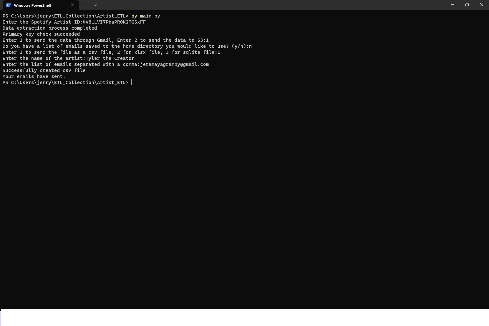
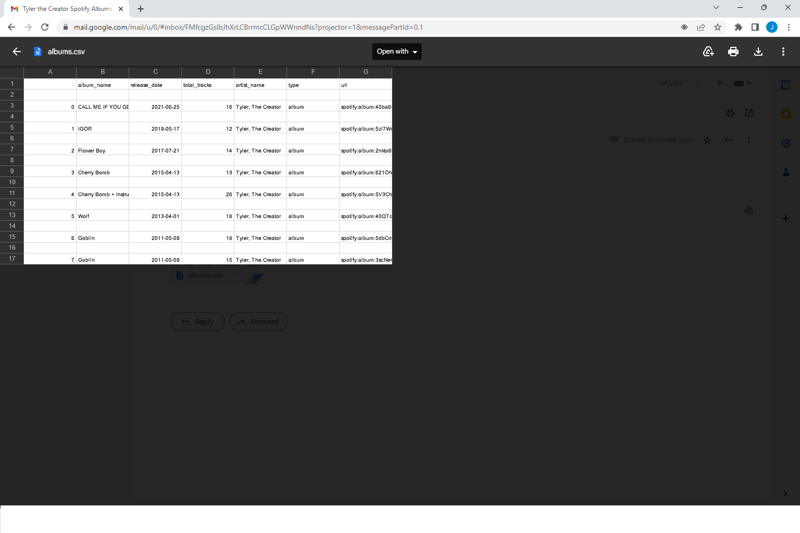
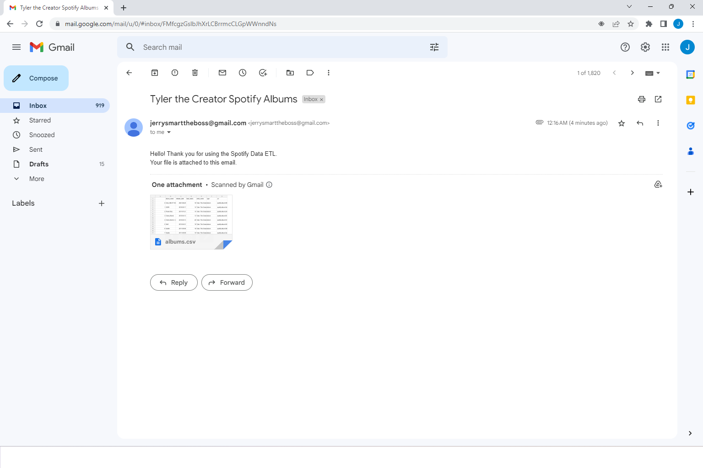

 

## This README file contains:
-Purpose of the project  
-Project Instructions 
-Project Weaknesses 
-Project Photos   
## Project Purpose:

With all the complexities surrounding AWS resources, completing rudimentary AWS tasks, such as uploading a file to an S3 bucket or launching an EC2 instance, can appear daunting to new cloud professionals. 

This project introduces a simple, programmatic solution for completing some of the most common tasks in AWS. The project files automate S3 bucket creation, S3 bucket deletion, S3 object uploading, S3 object deletion, EC2 instance creation, EC2 instance rebooting, EC2 instance stopping, EC2 instance starting, and EC2 state management.

The second version of the project includes an automation script which can perform all the previously listed EC2 and S3 tasks. (boto3script.py). It is a stateless automation script that can save time for DevOps professionals and increase their overall efficiency.  

## Instructions for ec2machine.py/s3machine.py:

1. Ensure you are connected to the internet and are registered as an IAM administrative user in AWS.

2. Create a key pair in Amazon and save the pem file to the main project directory. This project's gitignore is already preconfigured to ignore your pem file.

3. You will need to create a new session token every eighteen hours.  

To create a new token you will need to open the AWS CLI and type:
> aws configure

After entering your IAM credentials type:
> aws sts get-session-token

4. Create a .env file in the main directory to hold the session token and create variables that are equal to all the capitalized variables. (ACCESS_KEY, SECRET_ACCESS_KEY, SESSION_TOKEN, etc).

5. To create/start/stop/reboot an EC2 instance or to find a list of all running EC2 instances tied to your account, open ec2machine.py and uncomment the object that corresponds to the action you want to take. Then run ec2machine.py.

6. To upload/delete an object/file to a specified S3 bucket or create/delete an S3 bucket open ec2machine.py and uncomment the object that corresponds to the action you want to take. Then run s3machine.py.  

 
## Instructions for boto3script.py:

1. Ensure you are connected to the internet and your interpreter is properly configured.

2. Open a terminal window and change the current directory to the project folder

3. Run boto3script.py in the terminal window (py boto3script.py).

4. Enter your access key, session access key and session token.

5. Enter the region you would like to work from (ex: us-east-1)

6. Enter the service you would like to use (s3 or ec2).

7. Enter the number corresponding to the service you would like to use.

8. Answer the questions relevant to the service you would like to use.

9. Rerun the script to perform a different service.  

## Project Weaknesses:
The main weakness of this project is that the project files including the automation script can only perform EC2 and S3 related functions. The next versions of this project will incrementally introduce more AWS services that can be utilized.   

## Project Photos:  
  
  
  
